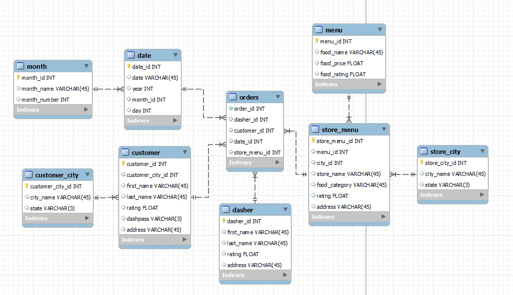

# DoorDash data warehouse
This project will
1. Designing a data warehouse using Snowflake schema and facts and dimensions table.
2. Insert data using SQL commands
3. Answer business questions by querying data

**Dimension table**: Stores description data that are related to facts.

**Fact table**: contains numeric measurements of business process and foregin keys to dimension table.  
  - Fact table serves as a portal to the dimension table

